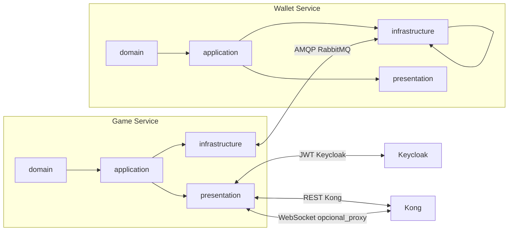

# Plano de implementação — Crash Game (camadas + testes locais)

Este plano replica a separação solicitada pelo desafio em **[domain](domain)** → **[application](application)** → **[infrastructure](infrastructure)** → **[presentation](presentation)**, em dois serviços independentes conforme `[fullstack-challenge/README.md](/home/gabriel/Projects/technical_challenges/crash_game/fullstack-challenge/README.md)`. O scaffold atual só expõe `GET /health` em `[services/games](/home/gabriel/Projects/technical_challenges/crash_game/fullstack-challenge/services/games)` e `[services/wallets](/home/gabriel/Projects/technical_challenges/crash_game/fullstack-challenge/services/wallets)`; o restante é verde para implementação.

---

## Mapa das camadas (como ler o plano)

**Regra útil**: em cada fase, implemente sempre **domain + testes unitários primeiro** (sem Docker), depois **application** (casos de uso com portas/interfaces), só então **infrastructure** e **presentation** (com Docker).

---

## Decisões técnicas a fixar no início (evita retrabalho)

| Tema             | Recomendação prática para o timeline de 5 dias                                                                                                                                                                                                                     |
| ---------------- | ------------------------------------------------------------------------------------------------------------------------------------------------------------------------------------------------------------------------------------------------------------------ |
| ORM              | **Prisma** ou **TypeORM/MikroORM** — uma escolha para os dois serviços, migrations versionadas (`[docker-compose.yml](/home/gabriel/Projects/technical_challenges/crash_game/fullstack-challenge/docker-compose.yml)` já sobe Postgres 18 em `games` e `wallets`). |
| WebSocket        | `**@nestjs/platform-socket.io`** + cliente no frontend; expor `:4001` direto inicialmente OU rotear pelo Kong só se já dominar plugins WebSocket.                                                                                                                  |
| Eventos RabbitMQ | Fila/exchange naming consistente (`wallet.commands`, `wallet.events`), payloads versionados (`v1`). Documentar saga de aposta na `[ARCHITECTURE.md](/home/gabriel/Projects/technical_challenges/crash_game/fullstack-challenge/ARCHITECTURE.md)` ou README.        |
| Dinheiro         | **Sempre centavos `bigint`** no domínio e no banco; API pode formatar em decimal string só na borda.                                                                                                                                                               |

---

## Fase 0 — Fundação do monorepo e contratos

**Objetivo**: dependências e tipos compartilhados sem acoplar domínio.

- Criar em `[packages/](/home/gabriel/Projects/technical_challenges/crash_game/fullstack-challenge/packages)` um pacote leve (ex.: `@crash/contracts`) com **nomes de filas/routing keys** e **interfaces TypeScript** dos eventos comanda/resposta (débito na aposta, crédito no cashout, crédito zero no crash, falhas e idempotência).
- Garantir `strict` no TypeScript de ambos os serviços; alinhar scripts `bun test` com pastas `tests/unit` e `tests/e2e` (já previstos no README).
- **Teste local**: `bun install` na raiz; `bun test` no pacote de contratos (se houver testes de schema) — **sem Docker**.

---

## Fase 1 — Wallet Service (vertical slice completo antes do motor do jogo)

Ordem interna por camada:

1. **Domain** (`[services/wallets/src/domain/](/home/gabriel/Projects/technical_challenges/crash_game/fullstack-challenge/services/wallets/src)`): agregado `Wallet` (uma por `userId` do Keycloak), invariantes (saldo nunca negativo), operações `credit`/`debit` em centavos, erros de domínio explícitos.
2. **Application**: casos de uso `CreateWalletForUser`, `GetMyWallet`, **handlers** que reagem a comandos da fila (não expor débito/crédito via REST, conforme README).
3. **Infrastructure**: repositório Postgres (ORM + migration), adaptador **RabbitMQ consumer** (ack/nack, retry controlado), **publisher** de respostas para o Game.
4. **Presentation**: `[wallets.controller.ts](/home/gabriel/Projects/technical_challenges/crash_game/fullstack-challenge/services/wallets/src/presentation/controllers/wallets.controller.ts)` — `POST /wallets`, `GET /wallets/me` com **guard JWT** (issuer `http://keycloak:8080/realms/crash-game` em Docker, JWKS).
5. **Seed de saldo** para o usuário `player` (migration/seed script) — exigência de entrega “usuário de teste com saldo”.

**Testes locais**

| Camada     | Como validar                                                                                                               |
| ---------- | -------------------------------------------------------------------------------------------------------------------------- |
| Domain     | `cd services/wallets && bun test tests/unit` — crédito/débito, saldo insuficiente, limites.                                |
| API        | `bun run docker:up` → `curl` via Kong `http://localhost:8000/wallets/me` com token do Keycloak; ou serviço direto `:4002`. |
| Mensageria | Publicar mensagem de teste (script `bun` ou Management UI `15672`) e verificar saldo no `GET /wallets/me`.                 |

---

## Fase 2 — Game Service: domínio + provably fair + persistência

1. **Domain**: `Round` (estados: betting → running → crashed/settled), `Bet` (uma por rodada por jogador, status pending/cashed/lost), `CrashPoint` / serviço de **provably fair** (geração determinística + função pura de verificação). **Sem** float: multiplicador pode ser racional fixo (ex. basis points) ou decimal via biblioteca controlada — documentar.
2. **Application**: orquestrar transições de rodada, **comandos** de aposta/cashout que dependem de portas: `WalletGateway` (interface), `RoundRepository`, `Clock`.
3. **Infrastructure**: ORM + tabelas `rounds`, `bets`; implementação `WalletGateway` via **RabbitMQ** (request/reply ou correlação por `correlationId` / `commandId`), com timeout e política de compensação (ex.: aposta cancelada se `DebitFailed`).
4. **Presentation (REST inicial)**: rotas do README via Kong — começar por `GET /games/rounds/current` e `GET /games/rounds/history` com dados mínimos; depois `POST /games/bet` e `POST /games/bet/cashout` com JWT; `GET /games/rounds/:id/verify` expondo seeds/hashes necessários à verificação independente.

**Testes locais**

| Camada          | Como validar                                                                                                        |
| --------------- | ------------------------------------------------------------------------------------------------------------------- |
| Domain          | `bun test tests/unit` — transições de `Round`, regras de `Bet`, **provably fair** reprodutível com fixture de seed. |
| Integração fila | Com Wallet rodando: aposta end-to-end **HTTP Game → Rabbit → Wallet → Rabbit → Game** antes de WebSocket.           |

---

## Fase 3 — Motor em tempo real + WebSocket (server → client)

- **Application + Infrastructure**: scheduler da rodada (timer de apostas, tick do multiplicador). Estratégia de sync: ou **tick server-side** com broadcasts periódicos, ou fórmula no cliente + **eventos de checkpoint** (documentar escolha).
- **Presentation**: `WebSocketGateway` apenas **emitindo** eventos: fase da rodada, multiplicador, lista de apostas atualizada, cashouts alheios, crash + payload de verificação.
- **Kong**: se o front falar só com `:8000`, configurar rota/proxy WebSocket para `games:4001`; senão, variável `VITE_GAME_WS_URL` apontando para `:4001`.

**Teste local**: duas abas no browser (ou dois clientes `wss`/`socket.io-client`) após `docker:up` — estado idêntico após eventos (eliminatório do README).

---

## Fase 4 — E2E API (obrigatório) e Swagger

- Escrever em `services/games/tests/e2e` os fluxos exigidos: aposta → progressão → cashout → saldo; aposta → crash → perda; erros (saldo insuficiente, aposta dupla, aposta fora da fase).
- Adicionar `@nestjs/swagger` nos dois serviços para documentar DTOs e facilitar revisão.

**Teste local**: `docker compose up` e `bun test tests/e2e` no Game (e Wallet se necessário para asserts de saldo via API).

---

## Fase 5 — Frontend (Vite + React recomendado para simplicidade)

- Scaffold em `[frontend/](/home/gabriel/Projects/technical_challenges/crash_game/fullstack-challenge/frontend)` alinhado ao workspace raiz (`[package.json](/home/gabriel/Projects/technical_challenges/crash_game/fullstack-challenge/package.json)`); **descomentar** serviço `frontend` no `[docker-compose.yml](/home/gabriel/Projects/technical_challenges/crash_game/fullstack-challenge/docker-compose.yml)` com `Dockerfile` multi-stage.
- OIDC: fluxo authorization code + PKCE contra Keycloak (redirect URIs já em `[docker/keycloak/realm-export.json](/home/gabriel/Projects/technical_challenges/crash_game/fullstack-challenge/docker/keycloak/realm-export.json)`).
- UI: TanStack Query + Zustand/Context; Tailwind v4 + shadcn; requisitos visuais e de UX do README (dark, responsivo, animações, toasts).
- **Teste local**: login `player` / `player123`; fluxo completo na UI; `bun test` no frontend se configurar Vitest.

---

## Fase 6 — Hardening eliminatório

- Garantir `bun run docker:up` **sem passos manuais**: migrations na subida (entrypoint ou serviço `migrate` com `depends_on`), realm Keycloak e Kong já existentes — revisar ordem e healthchecks.
- Revisar **precisão monetária** e ausência de float em todo o caminho.
- Atualizar README com decisões, trade-offs, como rodar testes e URLs (incluindo WebSocket).

---

## Ordem sugerida de commits (boas práticas de avaliação)

Pequenos commits verticais: `feat(wallet): domain + unit tests` → `feat(wallet): persistence + consumer` → `feat(game): round domain + provably fair` → `feat(game): bet flow with rabbit` → `feat(game): websocket` → `feat(frontend): auth + game page` → `test(e2e): ...`.

---

## Riscos a monitorar

- **Consistência eventual**: definir idempotência nos comandos de carteira (mesmo `commandId` não debita duas vezes).
- **Latência da aposta**: UX aceitável entre POST `/bet` e confirmação (loading + eventual consistência documentada).
- **WebSocket atrás do Kong**: pode exigir config extra; validar cedo com duas abas.

