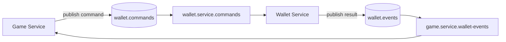
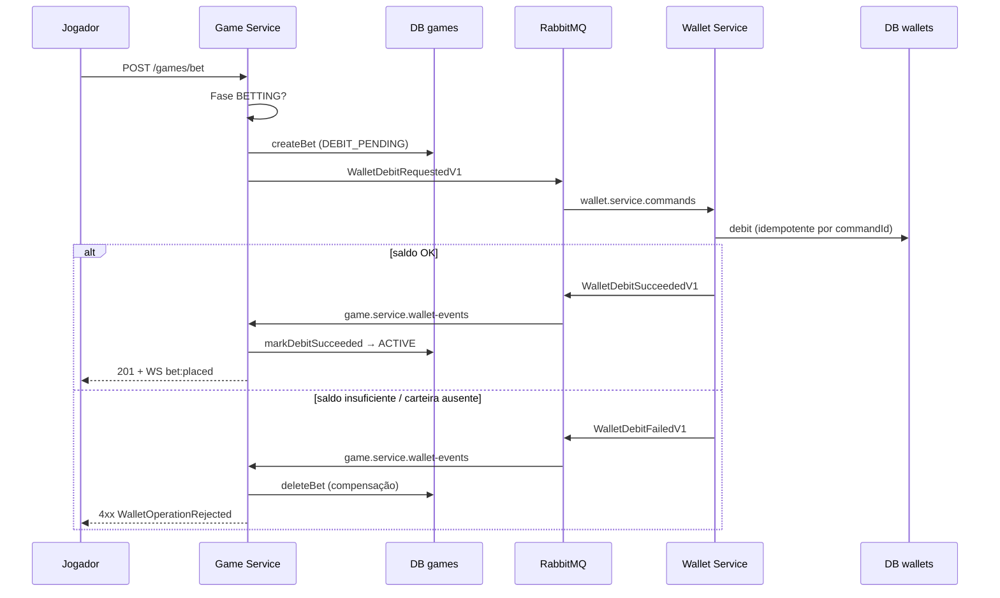
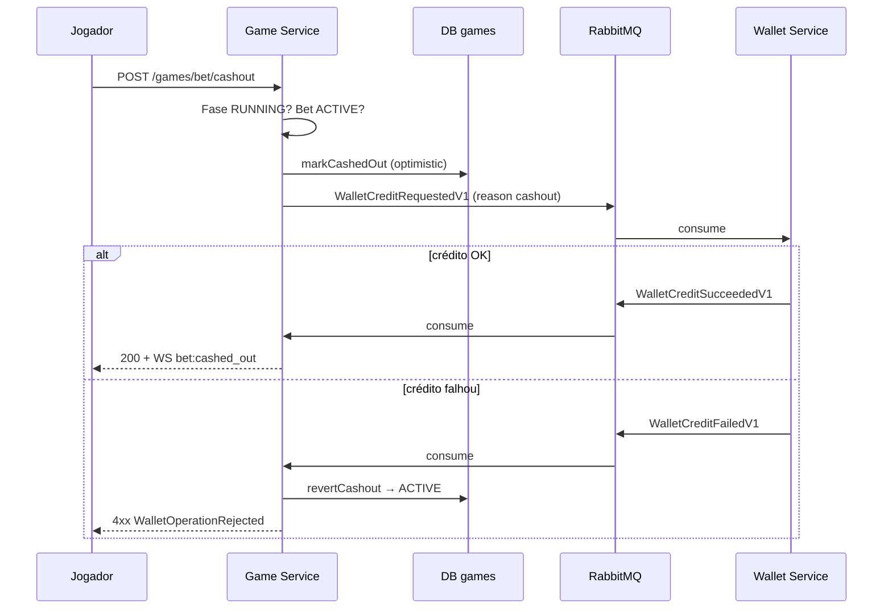
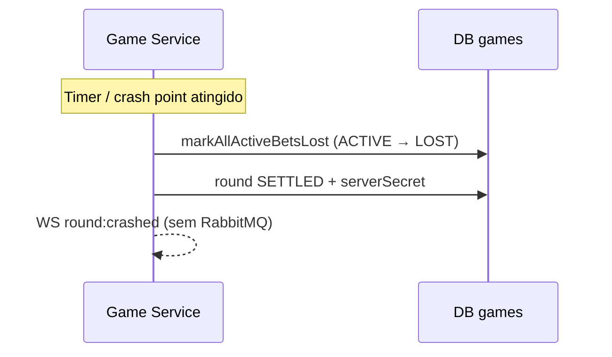

# Mensageria — saga Game ↔ Wallet

Documentação da integração **assíncrona** entre o Game Service e o Wallet Service via **RabbitMQ**. Os tipos de evento e as routing keys vivem em [`packages/@crash/contracts`](packages/@crash/contracts); a topologia AMQP em [`amqp-topology.ts`](packages/@crash/contracts/src/amqp-topology.ts).

Visão geral da arquitetura: [ARCHITECTURE.md](ARCHITECTURE.md) §4.4.

---

## 1. Topologia AMQP

| Recurso | Nome | Papel |
| ------- | ---- | ----- |
| Exchange (commands) | `wallet.commands` | Game publica comandos de débito/crédito |
| Exchange (events) | `wallet.events` | Wallet publica resultados |
| Fila (Wallet) | `wallet.service.commands` | Consome débitos e créditos |
| Fila (Game) | `game.service.wallet-events` | Consome resultados para correlacionar RPC |

O Game usa um padrão **request/reply sobre filas**: publica um comando, registra `commandId` em memória e resolve a Promise quando chega o evento de resultado com o mesmo `commandId` (ou estoura timeout).

---

## 2. Contratos e routing keys

### 2.1 Comandos (Game → Wallet)

| Tipo TypeScript | Routing key | Exchange |
| --------------- | ----------- | -------- |
| `WalletDebitRequestedV1` | `wallet.debit.request.v1` | `wallet.commands` |
| `WalletCreditRequestedV1` | `wallet.credit.request.v1` | `wallet.commands` |

Campos comuns (`EventMetadataV1`): `version: "v1"`, `commandId`, `correlationId`, `createdAt`. Identificação de negócio: `userId`, `gameRoundId`, `betId`. Valores monetários em `amount.amountInCents` (`bigint` serializado como string no JSON).

`WalletCreditRequestedV1` inclui `reason`: `"cashout"` | `"rollback"` | `"refund"` (hoje só **`cashout`** é emitido pelo Game em produção; `rollback`/`refund` estão no contrato para extensões).

### 2.2 Eventos de resultado (Wallet → Game)

| Tipo TypeScript | Routing key | Quando |
| --------------- | ----------- | ------ |
| `WalletDebitSucceededV1` | `wallet.debit.succeeded.v1` | Débito aplicado |
| `WalletDebitFailedV1` | `wallet.debit.failed.v1` | Saldo insuficiente, carteira ausente, etc. |
| `WalletCreditSucceededV1` | `wallet.credit.succeeded.v1` | Crédito aplicado |
| `WalletCreditFailedV1` | `wallet.credit.failed.v1` | Falha ao creditar |

Motivos de falha relevantes:

- Débito: `insufficient_funds`, `wallet_not_found`, `duplicate_command`, `unknown`
- Crédito: `wallet_not_found`, `duplicate_command`, `unknown`

Definições completas: [`events.ts`](packages/@crash/contracts/src/events.ts).

---

## 3. Saga: place bet (`POST /games/bet`)

Orquestração: [`PlaceBetUseCase`](services/games/src/application/use-cases/place-bet.use-case.ts). Gateway: [`RabbitMqWalletGateway`](services/games/src/infrastructure/messaging/rabbitmq-wallet.gateway.ts). Handler Wallet: [`ProcessWalletCommandHandler`](services/wallets/src/application/handlers/process-wallet-command.handler.ts).

### Passos

1. Validar valor da aposta e fase `BETTING` da rodada ativa.
2. Criar `Bet` com status `DEBIT_PENDING` e `debitCommandId` único (constraint: uma aposta por jogador por rodada).
3. Publicar `WalletDebitRequestedV1` e aguardar resultado (timeout configurável, padrão **15s** — `WALLET_RPC_TIMEOUT_MS`).
4. **Sucesso:** `markDebitSucceeded` → `ACTIVE`; broadcast WebSocket `bet:placed`.
5. **Falha de negócio:** `deleteBet` — a aposta nunca existiu do ponto de vista do jogador.
6. **Timeout:** `deleteBet` + `WalletOperationTimeoutError` para o cliente.

Não há crédito na Wallet neste fluxo; o stake já foi debitado.

---

## 4. Saga: cash out (`POST /games/bet/cashout`)

Orquestração: [`CashOutBetUseCase`](services/games/src/application/use-cases/cash-out-bet.use-case.ts).

### Passos

1. Rodada em `RUNNING`; aposta em `ACTIVE` (não `DEBIT_PENDING`).
2. Calcular `payoutInCents` com multiplicador atual (micro-units).
3. **Commit local primeiro:** `markCashedOut` (só se ainda `ACTIVE`) → status `CASHED_OUT`.
4. Publicar `WalletCreditRequestedV1` com `reason: "cashout"` e novo `commandId`.
5. **Sucesso:** resposta REST + `bet:cashed_out` no WebSocket.
6. **Falha / timeout:** `revertCashout` restaura `ACTIVE` (compensação da saga).

Ordem intencional: o Game assume o ganho no banco de jogos antes do crédito na Wallet; se o crédito falhar, desfaz o cashout para manter consistência entre os dois contextos.

---

## 5. Crash e liquidação (sem mensagem Wallet)

Quando o multiplicador atinge o crash point, [`GameRoundService.settleRound`](services/games/src/application/services/game-round.service.ts):

1. `markAllActiveBetsLost` — apostas ainda `ACTIVE` passam a `LOST`.
2. Rodada → fase `SETTLED`; revela `serverSecret` para provably fair.
3. WebSocket: `round:crashed`, `round:phase`, snapshot com bloco `verify`.

**Não há** `WalletCreditRequested` nem `WalletDebit` no crash:

- O stake já foi debitado no place bet.
- Jogadores que sacaram antes já receberam crédito no cash out.
- Perdedores (`LOST`) não recebem devolução — o saldo permanece debitado.

---

## 6. Idempotência e timeout

### Idempotência (`commandId`)

No Wallet, [`ProcessWalletCommandHandler`](services/wallets/src/application/handlers/process-wallet-command.handler.ts) consulta `processedCommands` antes de executar:

- Se o `commandId` já foi processado, **republica o mesmo evento de resultado** armazenado (replay seguro).
- Débito/crédito duplicado na entidade `Wallet` não ocorre duas vezes.

No Game, cada operação gera um `commandId` novo (`randomUUID()`), exceto o débito da aposta que reutiliza `debitCommandId` gravado na bet.

### Timeout RPC

[`RabbitMqWalletGateway`](services/games/src/infrastructure/messaging/rabbitmq-wallet.gateway.ts) mantém um `Map<commandId, PendingWalletOperation>`:

- Variável de ambiente: `WALLET_RPC_TIMEOUT_MS` (padrão `15000`).
- Ao expirar: rejeita com `WalletOperationTimeoutError`; o use case de aposta remove a bet pendente.

Eventos com `commandId` desconhecido (ex.: após restart do Game) são **ack** sem efeito — não há fila de dead-letter dedicada nesta versão.

### Serialização `bigint`

Comandos e eventos serializam `amountInCents` e `balanceAfterInCents` como **strings JSON**; deserialização em [`event-serializer`](services/games/src/infrastructure/messaging/event-serializer.ts) / equivalente no Wallet.

---

## 7. Resumo por fluxo de negócio

| Fluxo | REST | Comando AMQP | Compensação Game | Evento WS |
| ----- | ---- | ------------ | ---------------- | --------- |
| Apostar | `POST /games/bet` | `WalletDebitRequestedV1` | `deleteBet` se débito falhar/timeout | `bet:placed` |
| Cash out | `POST /games/bet/cashout` | `WalletCreditRequestedV1` (`cashout`) | `revertCashout` se crédito falhar | `bet:cashed_out` |
| Crash | — (scheduler) | — | — | `round:crashed` |

---

## 8. O que não está nesta versão

| Item | Estado |
| ---- | ------ |
| Outbox/Inbox transacional | Não implementado — publicação AMQP após commit local |
| DLQ / retry automático | `nack` sem requeue em erro de parse; comandos inválidos descartados |
| `rollback` / `refund` no Game | Contrato existe; use cases não emitem hoje |
| HTTP direto Game → Wallet | Proibido por design — apenas filas |

Evoluções sugeridas: [ARCHITECTURE.md](ARCHITECTURE.md) §11.

---

## 9. Referências de código

| Peça | Caminho |
| ---- | ------- |
| Contratos + routing keys | `packages/@crash/contracts/src/` |
| Gateway Game (publish + await) | `services/games/src/infrastructure/messaging/rabbitmq-wallet.gateway.ts` |
| Place bet | `services/games/src/application/use-cases/place-bet.use-case.ts` |
| Cash out | `services/games/src/application/use-cases/cash-out-bet.use-case.ts` |
| Settle / crash | `services/games/src/application/services/game-round.service.ts` |
| Consumer Wallet | `services/wallets/src/infrastructure/messaging/rabbitmq-wallet-command.consumer.ts` |
| Handler + idempotência | `services/wallets/src/application/handlers/process-wallet-command.handler.ts` |
| Publisher de eventos | `services/wallets/src/infrastructure/messaging/rabbitmq-wallet-event.publisher.ts` |
| Testes E2E Wallet (AMQP) | `services/wallets/tests/e2e/helpers.ts` |
| Testes unitários gateway | `services/games/tests/unit/messaging/` |
