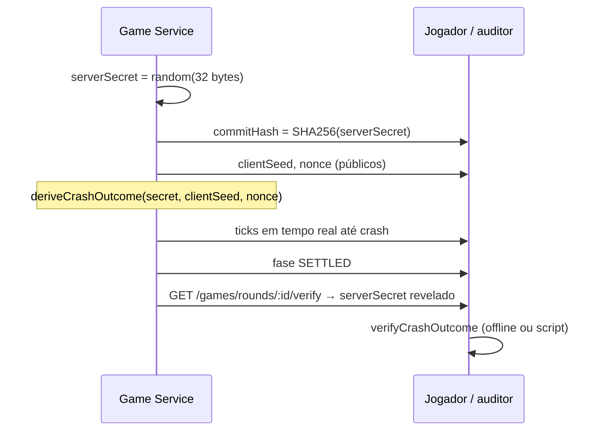

# Provably fair — Crash Game

Este documento descreve como o **crash point** de cada rodada é gerado de forma determinística e como **qualquer pessoa** pode verificar uma rodada encerrada sem confiar apenas na UI ou no backend.

A implementação de referência está em [`services/games/src/domain/services/provably-fair.ts`](services/games/src/domain/services/provably-fair.ts).

---

## Modelo: commit / reveal (não hash chain)

Muitos crash games usam **hash chains** (cada rodada consome um hash da cadeia) ou permitem que o jogador escolha o `clientSeed` antes da aposta.

**Decisão deste projeto:** usar **commit / reveal** por rodada:

| Fase | O que o servidor faz | O que é público |
| ---- | -------------------- | --------------- |
| Abertura da rodada | Gera `serverSecret` (64 hex aleatório) e publica `commitHash = SHA-256(serverSecret)` | `commitHash`, `clientSeed`, `nonce` |
| Durante a rodada | O `serverSecret` permanece oculto | Jogadores veem o multiplicador subir em tempo real |
| Após `SETTLED` | Revela `serverSecret` na API e no evento WS `round:crashed` | Qualquer um recalcula o crash e confere o commit |

**Por que não hash chain:** menor complexidade operacional (sem pré-gerar centenas de hashes), mantendo a propriedade essencial — o resultado **não pode ser alterado** depois que o `commitHash` foi publicado, porque mudar o `serverSecret` quebra `SHA-256(serverSecret) === commitHash`.

O `clientSeed` é gerado pelo servidor (16 bytes hex) e o `nonce` é um contador decimal por rodada (`"1"`, `"2"`, …). O jogador **não** escolhe a seed; a verificação independe disso, desde que os valores públicos coincidam com os usados no HMAC.

---

## Ciclo de vida dos dados por rodada



Enquanto a rodada **não** estiver em `SETTLED`, `GET /games/rounds/:id/verify` retorna `serverSecret: null` e `verified: false` — o segredo só é revelado após o encerramento.

---

## Algoritmo (resumo técnico)

### 1. Commit

```
commitHash = SHA-256(serverSecret)   // hex, 64 caracteres
```

### 2. Derivação do resultado

```
digest = HMAC-SHA256(key = serverSecret, message = clientSeed + ":" + nonce)
h  = primeiros 4 bytes de digest (uint32 BE)
h2 = bytes 4–7 de digest (uint32 BE)
```

**Multiplicador de crash** (aritmética inteira, sem `float`):

- `MICRO_UNIT = 1_000_000` → `1.00x` = `1_000_000` micro-units
- Fórmula clássica estilo crash:  
  `crashMultiplierMicro = ((100·2³² − h) / (100·(2³² − h))) · MICRO_UNIT` (divisão inteira)
- Limites: mínimo `1.00x`, máximo `1000.00x`

**Duração da subida** (determinística, usada pelo scheduler):

- `runDurationMs = 5000 + (h2 mod 40001)` → entre 5s e 45s

### 3. Verificação

`verifyCrashOutcome` confere, nesta ordem:

1. `commitServerSecret(serverSecret) === commitHash`
2. `deriveCrashOutcome(...)` produz o mesmo `crashMultiplierMicro` e `runDurationMs` persistidos na rodada

---

## Obter dados via API

Com a stack em execução (`bun run docker:up`):

```bash
curl -sS http://localhost:8000/games/rounds/ROUND_ID/verify | jq .
```

Resposta típica (rodada encerrada):

| Campo | Significado |
| ----- | ----------- |
| `roundId` | UUID da rodada |
| `commitHash` | Commit publicado no início |
| `serverSecret` | Segredo revelado (`null` se ainda não `SETTLED`) |
| `clientSeed` | Seed pública da rodada |
| `nonce` | Contador da rodada |
| `crashMultiplier` | Multiplicador final formatado (ex. `"2.45"`) |
| `runDurationMs` | Duração da fase RUNNING em ms |
| `verified` | `true` se o backend validou commit + outcome |

O histórico na UI também pode abrir o mesmo fluxo de verificação; o endpoint é a fonte canônica para auditoria.

---

## Verificação offline (passo a passo)

1. **Aguarde** a rodada em fase `SETTLED` (ou use o histórico de rodadas em `GET /games/rounds/history`).
2. **Baixe** os dados com `GET /games/rounds/:roundId/verify` (ou anote `serverSecret`, `commitHash`, `clientSeed`, `nonce`, `crashMultiplier`, `runDurationMs` do evento `round:crashed`).
3. **Confira o commit:** calcule `SHA-256(serverSecret)` e compare com `commitHash`.
4. **Recalcule o crash:** aplique `deriveCrashOutcome(serverSecret, clientSeed, nonce)` com a mesma implementação do servidor.
5. **Compare** `runDurationMs` e o multiplicador formatado (`1.01x` = duas casas decimais, como na API) com os valores publicados (o script abaixo faz isso automaticamente).

> A API expõe o crash com **duas casas decimais** (`formatMultiplierMicro`). A verificação offline usa o mesmo arredondamento; para auditoria com micro-units exatos, use `--crash-multiplier-micro` (valor inteiro do banco).

Se qualquer passo falhar, o resultado não é consistente com o commit publicado antes do crash.

---

## Script de verificação

Na raiz do monorepo:

```bash
# Via API (Kong em dev)
bun scripts/verify-round.ts <roundId>

# API customizada
bun scripts/verify-round.ts --api http://localhost:8000 <roundId>

# Modo manual (sem HTTP) — útil com dados copiados do WS ou do curl
bun scripts/verify-round.ts \
  --server-secret <hex64> \
  --commit-hash <sha256hex> \
  --client-seed <hex> \
  --nonce <string> \
  --crash-multiplier 2.45 \
  --run-duration-ms 12000
```

O script importa as mesmas funções puras do domínio (`commitServerSecret`, `deriveCrashOutcome`, `verifyCrashOutcome`) para evitar divergência de lógica.

**Fixture de teste** (mesmos valores de [`provably-fair.spec.ts`](services/games/tests/unit/domain/provably-fair.spec.ts)):

```bash
cd services/games && bun test tests/unit/domain/provably-fair.spec.ts

# Exemplo manual (valores do spec; ajuste crash/run após derivar uma vez):
SECRET=$(printf 'a%.0s' {1..64})
bun -e "
import { commitServerSecret, deriveCrashOutcome } from './services/games/src/domain/services/provably-fair.ts';
const s = '$SECRET';
const o = deriveCrashOutcome(s, 'client-seed-abc', '42');
console.log('commit', commitServerSecret(s));
console.log('crash micro', o.crashMultiplierMicro.toString());
console.log('runDurationMs', o.runDurationMs);
"

bun scripts/verify-round.ts \\
  --server-secret "$SECRET" \\
  --commit-hash <commit do comando acima> \\
  --client-seed client-seed-abc \\
  --nonce 42 \\
  --crash-multiplier-micro <crash micro do comando acima> \\
  --run-duration-ms <ms do comando acima>
```

Para uso diário, passe apenas o `roundId` com a API após uma rodada real.

---

## Relação com tempo real

Durante `RUNNING`, o multiplicador exibido **interpola** linearmente de `1.00x` até o crash em `runDurationMs` (`displayMultiplierMicroAtProgress`). O crash em si é fixo desde o início da rodada; apenas a animação depende do tempo decorrido.

---

## Documentos relacionados

| Arquivo | Conteúdo |
| ------- | -------- |
| [IMPLEMENTATION.md](IMPLEMENTATION.md) | Setup, decisões técnicas, link para este guia |
| [ARCHITECTURE.md](ARCHITECTURE.md) | Game service, WebSocket, endpoint `/verify` |
| [TESTING_SERVICES.md](TESTING_SERVICES.md) | `curl` e testes manuais |
